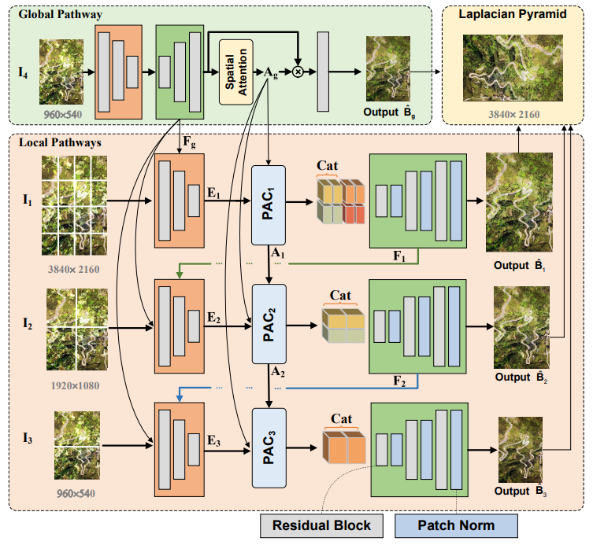

# GLSGN
Official pytorch codes for the paper:
- [Global-Local Stepwise Generative Network for Ultra High-Resolution Image Restoration](https://arxiv.org/pdf/2207.08808.pdf)

Tasks include image reflection removal, image deraining, and image dehazing.
## Network Architecture
<div  align="center">  </div>
The overall framework of our proposed GLSGN.

## Laplacian Pyramid
<div  align="center">  </div>

# Citation

If you find this work useful for your research, please cite:

```
@article{feng2022global,
  title={Global-Local Stepwise Generative Network for Ultra High-Resolution Image Restoration},
  author={Feng, Xin and Ji, Haobo and Pei, Wenjie, and Lu, Guangming},
  journal={arXiv preprint arXiv:2207.08808},
  year={2022}
}
```
